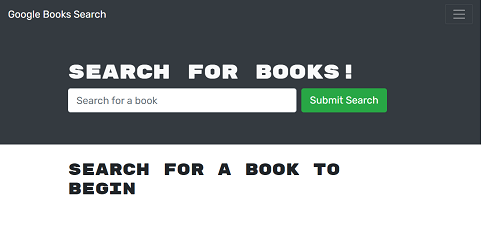
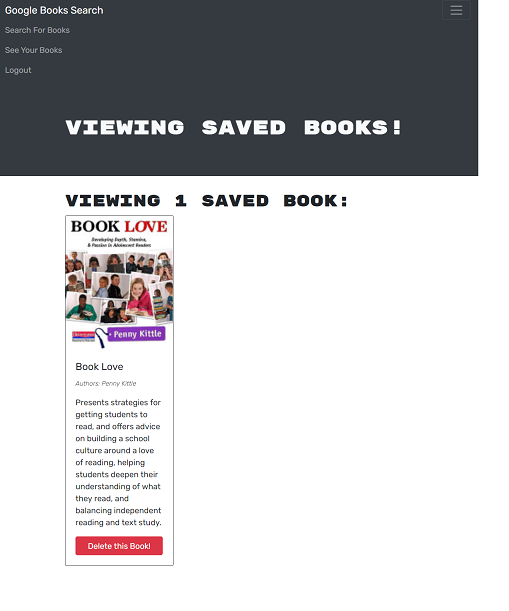

# Book Search Engine

## Description
This system allows users to search for books with any topics from publicly available Google API.  User can also save their chosen or favorite books to their account.  This is made with MERN and ApolloServer for connection and deployed in heroku.

## Installation

npm install in client folder, server folder and root of the project

## Usage

npm start

## Screenshot
#### Main Screen

##### 

#### Logged In Screen
##### 

## URLs

#### Deployed URL:
#### https://arlon-booksearch-engine.herokuapp.com/

#### Github URL:
##### https://github.com/ArlonTuazon/booksearch-engine
